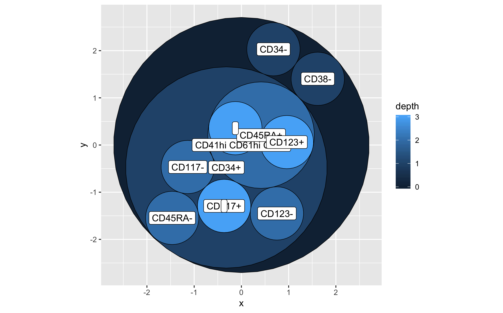

# Automatic-classification-of-CyTOF-measurements-to-generate-biomarkers-of-human-immunodeficiencies

## Background

The advent of mass and spectral cytometers have lead to the emergence of high-dimensional cytometry. With the ability to survey expression of tens of markers simultaneously for individual cells, the traditional approach of manual gating employed by the cytometry community at large has been superseded  by more computationally intensive methods of data analysis. There currently exist a host of computational approaches for the analysis of high-dimensional of cytometry data, however, ascribing biological relevance to the subpopulations identified by these tools remains on the biologist. Towards this, we have developed TBD.

Most high-dimensional cytometry studies seek to identify subpopulations that are associated with the experimental design and follow a fairly standard approach. After data collection, the data undergoes a series of quality control, normalization, and cleaning steps involving the removal of doublets, debris, and potentially the selection of known subsets of interest. The cleaned data is then segmented into subpopulations, usually by one of any number of clustering algorithms. Once subpopulations have been identified, each can be tested for evidence of differential expression or differential frequency across conditions of the experiment.  

## Approach

Cleaned single cell data, either in FCS format for high parameter cytometry, or full rank, log2 transformed, normalized, CPM values for single cell RNA seq. Data will be read into [HAL-x](https://pypi.org/project/hal-x/) (Hierarchical Agglomerative Learning). Briefly, HAL-x uses tSNE of one sample to quickly map every other sample. It then performs an iterative clustering process where it begins by overclustering using k-NN, and then performs a purify step, where clusters that are similar in expression are merged together. After it has sufficiently clustered the data, each subsequent data set is fitted to the cluster structure using a random forrest. 

For FCS files, automated immunophenotyping is performed by using k means clustering, very basic implementation of flowType approach. 

To assess differential expression and abundance, welch's t test was used.

Nextflow was used to handle the job operations for the tool. However, we do not use NextFlow to import the data that we used for our analysis, because we intend this workflow to be useful for other datasets. To import the data that we used run:

```
bash import_data.sh
```

Our NextFlow workflow file was used to generate this workflow diagram: 

Docker was used to create the container. 

## Results

A network of autoimmune phenotypes:



Frequencies of clusters across samples


Median expression of each marker across clusters


## Documentation

### Docker container
You can find our docker file on dockerhub at [tangwanhu/cytomap](https://hub.docker.com/r/tangwanhu/cytomap)

To explore the docker container
```
sudo docker pull tangwanhu/cytomap:first
sudo docker run -it tangwanhu/cytomap:first
```

**NOTE: This is just a skeleton and will not run at this time**

To run our entire pipeline inside a docker container run:
```
bash import_data.sh
sudo docker pull tangwanhu/cytomap:first
nextflow run main.nf --cytof data/cytof/mice --scrna data/scRNAseq/mice -with-docker tangwanhu/cytomap:first
```

### Package dependencies

Python packages
- [Numpy](http://www.numpy.org/)
- [scikit-learn](https://scikit-learn.org/stable/)
- [Pandas](https://pandas.pydata.org/)
- [Cython](https://cython.org/)
- [fftw](http://www.fftw.org/)
- [scipy](scipy)
- [HAL-x](https://pypi.org/project/hal-x/)

R packages
- [FlowRepositoryR](https://www.bioconductor.org/packages/release/bioc/html/FlowRepositoryR.html)
- [Matrix](https://cran.r-project.org/web/packages/Matrix/index.html)
- [ggraph](https://github.com/thomasp85/ggraph)    

### Methods details

## Data

Below is the data used to prototype and develop the project.

### Human

[JCI Paper](https://insight.jci.org/articles/view/124928#sd)

JCI Insight. 2018;3(23):e124928. [DOI](https://doi.org/10.1172/jci.insight.124928)

Flow Cytometry

[Flow Repo link 1](http://flowrepository.org/id/FR-FCM-ZYQ9)

Mass Cytometry

[Flow Repo link 2](http://flowrepository.org/id/FR-FCM-ZYQB)

scRNA-Seq

[GEO link](https://www.ncbi.nlm.nih.gov/geo/query/acc.cgi?acc=GSE120221)

bulk RNA

[GEO link](https://www.ncbi.nlm.nih.gov/geo/query/acc.cgi?acc=GSE120446)

[Algorithm](https://pypi.org/project/hal-x/#description)

[Single Cell Database](http://imlspenticton.uzh.ch:3838/conquer/)

### Mouse

[Cell Paper](https://www.sciencedirect.com/science/article/pii/S009286741831242X?via%3Dihub)

Cell, Volume 175, Issue 5, 15 November 2018, Pages 1443. [DOI](https://doi.org/10.1016/j.cell.2018.09.030)

T3 checkpoint therapy x 5 replicates (CyTOF)

[Flow Repo link 1](http://flowrepository.org/id/FR-FCM-ZYPM)

T3 checkpoint therapy: time course, days 5-12 (CyTOF)

[Flow Repo link 2](http://flowrepository.org/id/FR-FCM-ZYPN)

T3 checkpoint therapy x 5 replicates (CyTOF)

[Flow Repo link 3](http://flowrepository.org/id/FR-FCM-ZYPX)

CD45+ scRNAseq

[GEO link](https://www.ncbi.nlm.nih.gov/geo/query/acc.cgi?acc=GSE119352)

[Tabula muris dataset](https://tabula-muris.ds.czbiohub.org/)

## Hackathon members

Brian Capaldo brian.capaldo@gmail.com

Ratnadeep Mukherjee ratnadeep.mukherjee@gmail.com Team Lead

Wanhu Tang tangw2@niaid.nih.gov

James Anibal james.anibal@nih.gov Team Lead

Gege Gui gege.gui@nih.gov

Jaleal Sanjak jsanjak@gryphonscientific.com

## References

Coming soon...
